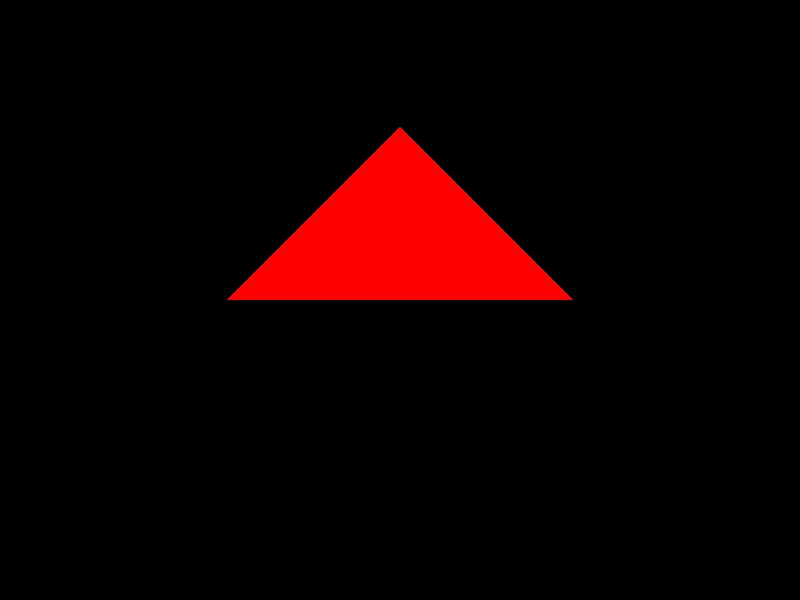

# Homework 2: Theme 1: Ray Tracing Framework

In theme 1, you will be writing, testing, and evaluating a ray tracing renderer named `Olio`. Eventually, this will be a well-featured renderer, but for this week you should just get the basic framework working. We will implement the most basic functionality:
* Scene file read
* Camera & image setup
* Primary ray generation
* Ray/sphere and ray/triangle intersection
* Image write
* no: shading,lights, etc. yet

Relevant reading: Chapter 4 of the textbook. `Olio` executable should read in the scene file, build the camera model and set up the image, and generate rays -- 1 for each pixel.  For any pixel, if there is a ray-sphere or ray-triangle intersection, the color for that pixel should be red (i.e. [1 0 0]). If there is no intersection, the color of that pixel should be black (i.e. [0 0 0]). After rendering all the pixels, the EXR image file should be saved and the program should exit.

The `Olio` executable takes two arguments - the name of a scene file to read, and the name of the image file to be written. The scene file format is a text format and is documented in the "Pages" section of CourseWorks; it typically has a ".scn" extension. A basic parser is supplied in `src/core/parser/raytra_parser.{h,cc}`.

For this part of the assignment, only the camera, sphere, and triangle commands need to be working (from the scene file format).  Some test scenes will be posted, but we suggest you make your own as well. The scene will be designed, for this early assignment, so that a single sphere (or triangle) is only in front of the camera.

Your code should compile with:
```
mkdir build
cd build
cmake -DCMAKE_BUILD_TYPE=Release ..
make
```

Your source code should be .cc and .h files, and you can use standard C++11 includes and features. To parse a scene and render an image, Olio should be run with:
```
./src/rtbasic/olio_rtbasic -s <scene_file> -o <output_image>
```

You should implement and use your own unit tests in `src/tests/main.cc`.

Things to implement:
## 1. Ray and HitRecord classes [15 points]
Implement the `Ray` and `HitRecord` classes in `src/core/ray.{h.cc}`.

## 2. Sphere class [15 points]
Implement the `Sphere` class in `src/core/geometry/sphere.{h,cc}`.

Note: all surfaces (e.g., spheres and triangles) and, more generally, scene nodes in Olio must be created as smart pointers using the `Create(..)` factory function for that type. For example, a sphere object can be created with:
```
Sphere::Ptr sphere = Sphere::Create(center, radius);
```
or in C++11 with the `auto` keyword the above code can be shortened to this:
```
auto sphere = Sphere::Create(center, radius);
```

## 3. Triangle class [25 points]
Implement the `Triangle` class in `src/core/geometry/triangle.{h,cc}`.

## 4. Camera class [25 points]
Implement the `Camera` class in `src/core/camera/camera.{h,cc}`.

## 5. RayTracer class [15 points]
Finish the implementation of `RayTracer` class in `src/core/renderer/raytracer.{h,cc}`.
You'll only need to finish the implementations of two functions: `RayColor()` and `Render()`.

## 6. Executable's main function [5 points]
Implement the `main()` function in `src/rtbasic/main.cc`


Running `olio_rtbasic` on the sphere test scene (`data/scenes/sphere_test.scn`) should produce this image:


Running `olio_rtbasic` on the triangle test scene (`data/scenes/triangle_test.scn`) should produce this image:


