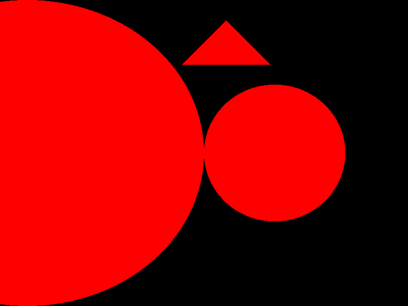
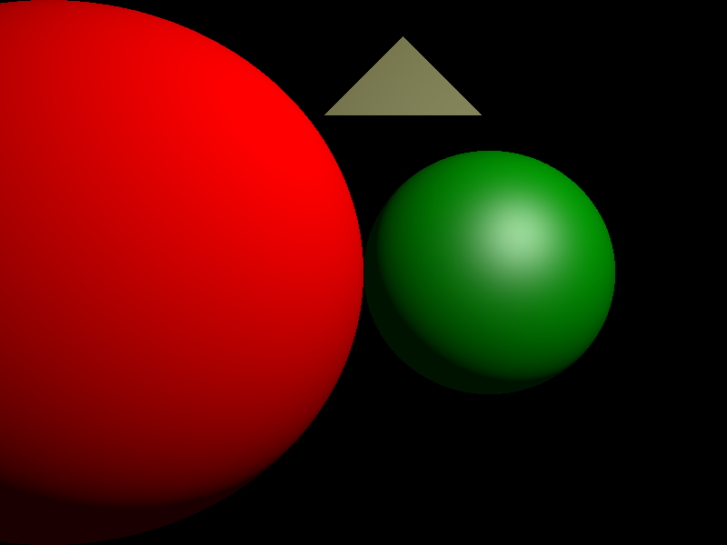
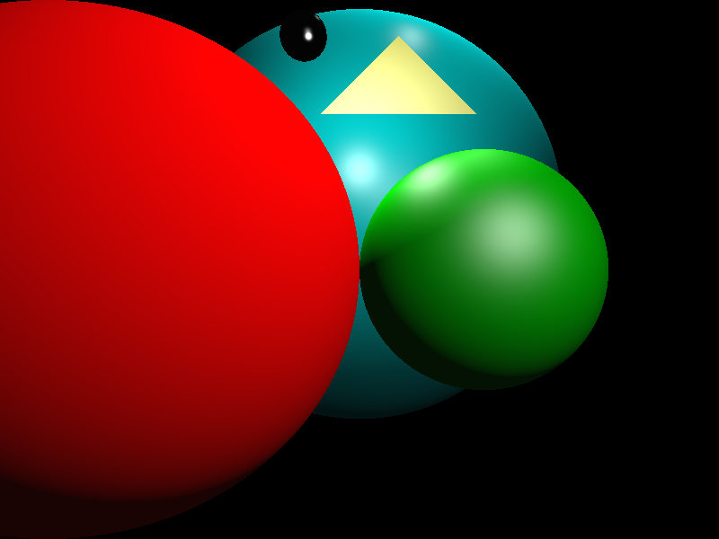

# Homework 3

Make sure to read chapter 5 first.

## Phong Shading
For the second milestone, you will extend your renderer so that it computes some reasonable shading model for each intersection point on the surface (sphere or triangle); you will use the Blinn-Phong model that is described in the textbook chapter 4.5. You will also extend it to handle multiple spheres and triangles in the scene.

Now, your code will not only have to see if the ray through a pixel intersects a sphere (or a triangle), but it must determine *which* of the possible intersections (if there is more than one) is the closest. And for that closest intersection, you will need to retain the intersection point, the surface normal, and the material associated with the intersected surface (we already keep track of most of that information in `HitRecord` that you implemented in the previous assignment, but you'll need to slightly extend it to support surface material as well). You can then compute the Blinn-Phong shading at the intersection point and use that value for your image RGB value. 

The information you need to use to compute the Blinn-Phong shading is:
* the surface normal at the (closest) intersection point
* the normalized vector from the intersection point to the light
* the normalized vector that is opposite the camera ray direction vector
* the energy coming from the light source
* the diffuse & specular coefficients of the material, and its Phong exponent

From these values, you can compute the diffuse contribution and specular contribution to the shading at the intersection point. Add them together to get the result.

In order to accomplish this, your parser will need to start recognizing material definitions, and assign them to each geometric primitive defined subsequently. Your parser will also have to read in any light defined in the scene file. Point and ambient lights do NOT go on the Surface list - they are not usually intersected by rays in the scene - they are only used for lighting calculations.

Good luck - once this works, you will start to see some good images!

# Implementation Details
Things to implement:

## 1. SurfaceList class [10 points]

Add a new class called `SurfaceList` to `src/core/geometry`. The header and source files should be called `surface_list.h` and `surface_list.cc`, respectively. Make sure to also add their names to the HEADERS and SOURCES lists in `src/core/CMakeLists.txt`. Use the implementation of the `Sphere` class as a template.

This class will contain a list of hittable surfaces.

The new class should be derived from `Surface`, and implement the following functions:
* A parameterized constructor:
  ```
  SurfaceList(const std::vector<Surface::Ptr> &surfaces, const std::string &name=std::string());
  ```
  the `surfaces` list should be stored in a private/protected data member of the class (e.g., `surfaces_`).

* An overridden `Hit()` function:
  ```
  bool Hit(const Ray &ray, Real tmin, Real tmax, HitRecord &hit_record) override;
  ```

  This function should iterate through all the surfaces in `surfaces_` and find out if the input ray hits any of them. If it does, the `hit_record` by the function should correspond to the surface that's closest.

## 2. Update the Scene Parser [10 points]

Update the scene parser (`src/core/parser/raytra_parser.{h,cc}`) to support loading multiple surfaces. This should return a `SurfaceList` of those surfaces as the 'scene' object that is returned by the function.

Your rendered image with the scene `data/scenes/multiple_surfaces_no_mat.scn` should look like this:



## 3. Point and Ambient Lights [25 points]

Implement `PointLight` and `AmbientLight` classes in `src/core/light/light.{h,cc}`. They should both be subclasses of the `Light` class.

`PointLight` should implement:
* Constructor:
  ```
  PointLight(const Vec3r &position, const Vec3r &intensity, const std::string &name=std::string());
  ```
  which stores the point light's position and intensity (say, in `position_` and `intensity_` data members).

* Set (and get) functions for setting (and getting) the light's position and intensity (`SetPosition, SetIntensity, GetPosition, GetIntensity`).

* Overridden `Illuminate()` function from the `Light` class: the function should perform Blinn-Phong shading computation described in the book: it should first compute the irradiance at the hit point. The function should then retrieve the Phong material from the hit_record. It should then compute the total attenuation caused by the material at the hit point. The final shading will be the result of multiplying each RGB value of the irradiance by their respective attenuation coefficients returned by the material's `Evaluate()`. See the textbook and class notes for more details.

The class should be declared in the header file and the definitions of its members functions should go in the `.cc` file.

`AmbientLight` should implement:
* Constructor:
  ```
  AmbientLight(const Vec3r &ambient, const std::string &name=std::string());
  ```
  which stores the light's ambient intensity (say, in `ambient_`).

* Set (and get) functions for setting (and getting) the light's intensity (`SetAmbient, GetAmbient`).

* Overridden `Illuminate()` function from the `Light` class: the function should first retrieve the Phong material from the hit_record. The final shading will be the result of multiplying each RGB value of the light's ambient intensity by the material's respective ambient coefficients. See the textbook and class notes for more details.

The class should be declared in the header file and the definitions of its members functions should go in the `.cc` file.

## 4. PhongMaterial Class [20 points]

Implement the `PhongMaterial::Evaluate()` function in `src/core/material/phong_material.cc`. The function should compute the Blinn-Phong diffuse and specular coefficients that will be used to attenuate the irradiance at the hit point. Note that the mirror coefficients are unused.

## 5. Scene File Parser [15 points]
Note: see `raytra_scene_file_format.pdf` for a description of the scene file (https://courseworks2.columbia.edu/courses/193067/wiki)
* Parser: Update the scene file parser to:
  * Read the ambient light in the scene (if it exists) with the `l a` command. If the scene file contains more than one ambient light, the function should print an error message and return false.
  * Read the point lights in the scene with the `l p` command. All point lights should be added to the list of lights that's returned by the function.
  * Read the Phong materials with the `m` command and assign them to the correct surfaces. Assuming that the current material resides in `current_material` (which is a `PhongMaterial::Ptr`), it can be assigned to a surface with `surface->SetMaterial(current_material)`. If a surface is read from the scene file, but no material has been declared yet, the function should print an error message and return false.
  * The new `ParseFile` function signature should look like this:
  ```
  //! \brief Parse Raytra scene file
  //! \param[in] filename Name of scene file to parse
  //! \param[out] scene Pointer to a SurfaceList object containing all the surfaces in the file
  //! \param[out] lights List of all (ambient and point) lights in the file
  //! \param[out] camera Scene's camera as defined in the file
  //! \param[out] image_size Dimensions of the output image to render
  //! \return true on success
  bool RaytraParser::ParseFile(const std::string &filename, Surface::Ptr &scene, std::vector<Light::Ptr> &lights, Camera::Ptr &camera, Vec2i &image_size);
  ```
  * Note: the Phong material definition in the scene file does not have ambient coefficients. When parsing the scene file, set the ambient coefficients for the materials equal to their diffuse coefficients. If the diffuse coefficient of the material for a channel is less than 0.01, set the ambient coefficient for that channel to 0.01; otherwise, set the ambient coefficient for the channel to the same value as the diffuse coefficient.

## 6. RayTracer [15 points]
* Update the `RayTracer::RayColor()` implementation as discussed in class and Sec. 4.5.2 of the textbook. The updated function signature should look like this:
  ```
  bool RayColor(const Ray &ray, Surface::Ptr scene, const std::vector<Light::Ptr> &lights, Vec3r &ray_color);
  ```

* Update `RayTracer::Render()` to also accept the scene lights as an argument and pass them to `RayColor()` at render time. The function signature should look like this:
  ```
  bool Render(Surface::Ptr scene, const std::vector<Light::Ptr> &lights, Camera::Ptr camera);
  ```

## 7. `main()` [5 points]
Update the `main` function in `src/rtbasic/main.cc` to call `ParseFile()` with the correct arguments and pass them to `RayTracer::Render()`.

## First shaded renders!
Rendering `data/scenes/multiple_surfaces_with_mat.scn` should produce this image:



Rendering `data/scenes/multiple_surfaces_with_mat_2.scn` should produce this image:


