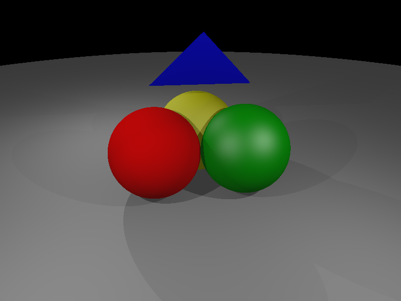
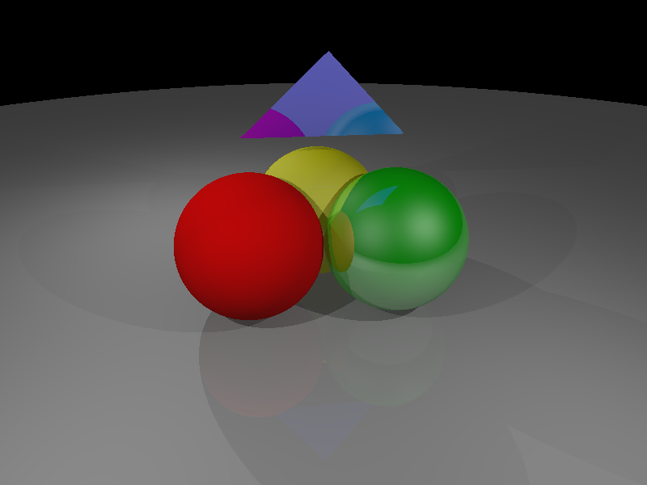
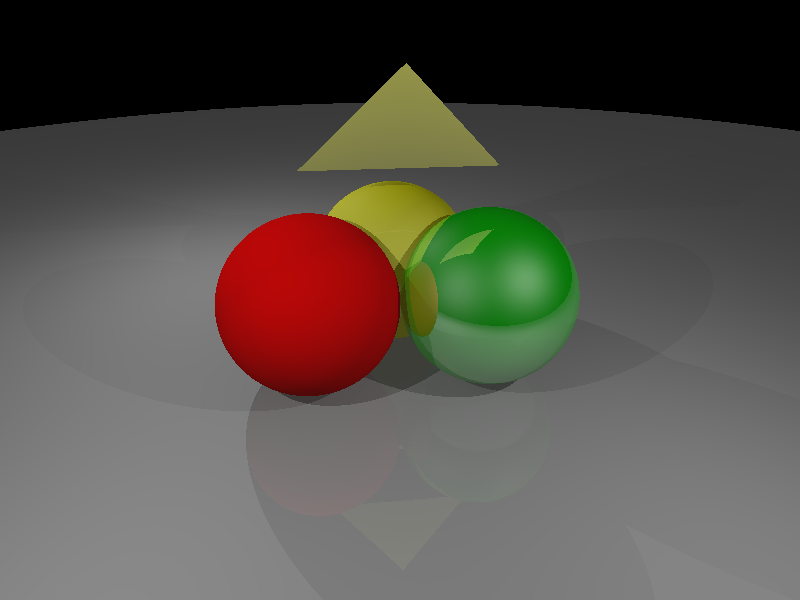
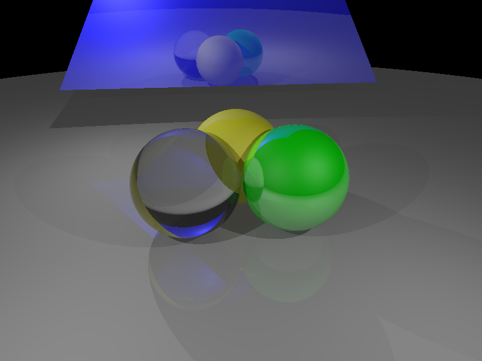

# Homework 4

## Shadows [20 points]

Extending Olio's capabilities to support true shadows.

Shadows: by using a ray starting from the hit point to the light source to see if there is an occluding object between the hit point and light. So, for example, there might be three point lights, but not every hit point in the scene receives light from every source - luckily for us, this behavior is linear and we can just sum contributions from each (visible) light source. These rays that are sent from hit points to light sources are generally known as shadow rays.

This is discussed in your reading [Sec. 4.5.3] and again in class. For this feature, `PointLight::Illuminate()` for PointLights needs to be modified. The new function signature will be:
```
PointLight::Illuminate(const HitRecord &hit_record, const Vec3r &view_vec, Surface::Ptr scene) const
```
It is recommended that you make this change in the base `Light` class and all its derived classes.

With this addition, rendering `data/scenes/three_spheres.scn` should produce this image:



## True Reflections [30 points]

For this part of the assignment, you are to extend Olio's capabilities to permit true specular reflections. To do this, you will implement recursive ray-tracing as discussed in class and at the end of the text's chapter 4.

The material definitions in the scene file contain a third triple (after the Phong exponent) which specifies the coefficient for the ideal reflective rays (K_m in the book) - when these are [0 0 0] there is no need to call the recursive function (as it would be weighted by zero in any case).

The function that will need to be modified is `RayTracer::RayColor()`. The updated function signature should be:
```
bool RayTracer::RayColor(const Ray &ray, Surface::Ptr scene, const std::vector<Light::Ptr> &lights, uint ray_depth, uint max_ray_depth, Vec3r &ray_color);
```

With this addition, rendering `data/scenes/three_spheres.scn` should produce this image:



## Backfacing Materials [10 points]

Implement a backside materials: the "back" side of triangles get a special material that has only diffuse (zero specular) and its diffuse components are [1 1 0] (bright yellow). You will need to make this change in `PhongMaterial::Evaluate()`. Make sure to also turn off true reflections for backfacing materials. This will allow you to debug geometry problems quickly....

With this addition, rendering `data/scenes/three_spheres.scn` should produce this image:



## Dielectrics [40 points]

Because of the behavior of refraction, it is only implementable on closed volumes, and since the only closed objects you have implemented are spheres, limit yourself to that.

### Implementation details:

#### PhongDielectric class

Implement a new `PhongDielectric` material class. The class must inherit `PhongMaterial` and implement a new `Scatter()` function, which will be called instead of PhongMaterial's `Evaluate()`:

```
//! \brief Scatter incoming ray ray_in
//! \details The function will generate a reflection and a refraction
//!    ray. The refraction ray will be null (not generated) if there is total
//!    internal reflection.
//! \param[in] hit_record Hit record at hit point
//! \param[in] ray_in Incoming ray that hit the point
//! \param[out] reflect_ray Reflected ray
//! \param[out] refract_ray Refracted ray (null if not refracted because of total internal reflection)
//! \param[out] schlick_reflectance Schlick's reflectance
//! \return Attenuation factor (how much color of reflected/refracted
//! rays should be attenuated)
Vec3r Scatter(const HitRecord &hit_record, const Ray &ray_in, std::shared_ptr<Ray> &reflect_ray, std::shared_ptr<Ray> &refract_ray, Real &schlick_reflectance) const;
```
The source and header files for the class must be `src/core/material/phong_dielectric.cc` and `src/core/material/phong_dielectric.h`, respectively. Make sure to add the file names to `src/core/CMakeLists.text`.

#### RayTracer
`RayTracer::RayColor()` must then be modified to detect and handle dielectric materials differently. 

#### Scene File Parser

Add support for parsing dielectric Phong materials to the scene parser (as documented in `raytra_scene_file_format.pdf` on CourseWorks).

With this addition, rendering `data/scenes/three_spheres_glass.scn` should produce this image:


